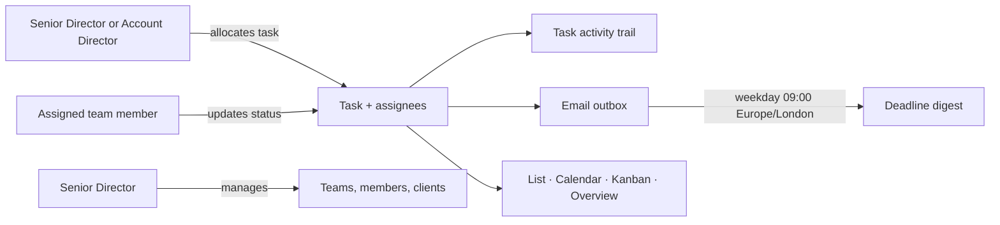
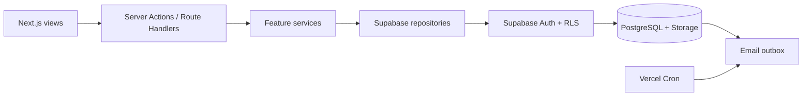

# Bespoke

Bespoke is a secure, role-aware task management system for teams delivering client work. It gives individual contributors, Account Directors, and Senior Directors a shared view of commitments, workload, deadlines, and client delivery—without giving client users access to the workspace.

Built with Next.js and Supabase, Bespoke combines a focused task workspace with database-enforced permissions, audit history, image attachments, and automated email notifications.

## What it does

- Create and manage client-delivery tasks with a client, priority, due date, description, and one or more assignees.
- Track work through **To do**, **In progress**, **Blocked**, and **Complete** statuses.
- Work in List, Calendar, and Kanban views, with shared filtering by client, team, assignee, status, priority, deadline, and free-text search.
- Surface operational risk in the Overview: open work, overdue work, deadlines due soon, completion and on-time rates, workload by client, and workload by person.
- Attach up to four task images (PNG, JPEG, or WebP; 5 MB each) to give assignments useful visual context.
- Keep a task activity trail for creation, assignment, status changes, and completion.
- Send assignment notifications and an idempotent weekday deadline digest through an outbox worker.
- Let Senior Directors maintain teams, invite and deactivate members, set roles, and manage active or archived clients.
- Let every signed-in user maintain their own profile name and initials.

## Roles and access

| Role | Workspace access | Task permissions | Administration |
| --- | --- | --- | --- |
| **Senior Director** | All teams and all client work | Create, edit, assign, and update any task | Create and rename teams; invite, change, and deactivate members; manage clients |
| **Account Director** | Their own team’s work | Create, edit, assign, and update tasks for their team | No organisation-wide administration |
| **Team member** | Their own team’s work | Update the status of tasks assigned to them | No task allocation or administration |

These rules are checked in Server Actions and enforced again in Supabase Row Level Security (RLS). Roles come from the application `profiles` table—not editable Auth user metadata.

## Product flow



## Architecture

The project uses feature-aligned MVC boundaries so the UI, business rules, and data access stay separate.



| Area | Purpose |
| --- | --- |
| `app/` | App Router pages, route handlers, layout, and protected route entry points |
| `features/*/views` | React UI and interaction state |
| `features/*/controllers` | Server Actions that authenticate, validate, authorise, and revalidate |
| `features/*/services` | Business use cases, reporting, validation, and notification rules |
| `features/*/repositories` | The only layer that queries Supabase |
| `features/*/models` | Types, Zod schemas, filters, and domain vocabulary |
| `lib/supabase/` | Browser/server clients, session refresh, environment validation, and server-only admin access |
| `supabase/migrations/` | Versioned PostgreSQL schema, triggers, functions, storage policies, and RLS policies |

### Data and notification model

The core relationship is `teams → profiles → clients → tasks`. A task has a primary owner for compatibility and a `task_assignees` join table for multi-person assignments. PostgreSQL triggers record task activity and enqueue assignment notifications. The protected cron endpoint creates deduplicated weekday deadline digests and flushes the outbox through SMTP locally or Resend in production.

All browser-accessible tables and the private `task-attachments` storage bucket are protected by RLS. The Supabase service-role key is used only by server-side invitation, deactivation, and email-worker operations.

## Tech stack

- **Frontend:** Next.js 16 App Router, React 19, TypeScript, Tailwind CSS 4
- **Data and identity:** Supabase Auth, PostgreSQL, Row Level Security, and Storage
- **Validation and data UI:** Zod and TanStack Query
- **Email:** Nodemailer + Mailpit for local development; Resend for production
- **Testing:** Vitest, Testing Library, and pgTAP RLS tests
- **Deployment:** Vercel, including scheduled cron invocations

## Run locally

### Prerequisites

- Node.js 20 or later
- Docker Desktop running on Windows
- npm (the Supabase CLI is installed with the project dependencies)

Use **Windows PowerShell** from the repository root. Do not mix in a WSL-produced `node_modules` directory.

### 1. Install and configure

```powershell
npm install
Copy-Item .env.example .env.local
npm run db:start
npx supabase status -o env
```

Copy the values printed by the last command into `.env.local`:

```dotenv
NEXT_PUBLIC_SUPABASE_URL=<API_URL>
NEXT_PUBLIC_SUPABASE_PUBLISHABLE_KEY=<PUBLISHABLE_KEY>
SUPABASE_SERVICE_ROLE_KEY=<SERVICE_ROLE_KEY>
NEXT_PUBLIC_SITE_URL=http://localhost:3000
```

Keep `SUPABASE_SERVICE_ROLE_KEY` and `CRON_SECRET` server-only. Never add a `NEXT_PUBLIC_` prefix to either value, and never commit `.env.local`.

### 2. Start the application

```powershell
npm run dev
```

Open [http://localhost:3000](http://localhost:3000). The app redirects unauthenticated visitors to the sign-in page.

Local Supabase services use these addresses:

| Service | Address |
| --- | --- |
| Application | `http://localhost:3000` |
| Supabase Studio | `http://localhost:56423` |
| Mailpit inbox | `http://localhost:56424` |
| Mailpit SMTP | `127.0.0.1:56425` |
| Supabase API | `http://127.0.0.1:56421` |

### Local demo accounts

`npm run db:reset` applies every migration and restores deterministic demo data. All seeded accounts use the password `DemoPass!2026`.

| Role | Email |
| --- | --- |
| Senior Director | `alex.morgan@taskhub.demo` |
| North Account Director | `sophie.turner@taskhub.demo` |
| South Account Director | `marcus.reed@taskhub.demo` |
| North team member | `zoe.patel@taskhub.demo` |
| South team member | `olivia.grant@taskhub.demo` |

The local Mailpit inbox captures invitation, password-recovery, and notification emails. Production users are invite-only: a Senior Director invites an account, and the recipient verifies the email link before choosing a password.

## Environment variables

Begin with [`.env.example`](.env.example). The main variables are:

| Variable | Required | Description |
| --- | --- | --- |
| `NEXT_PUBLIC_SUPABASE_URL` | Yes | Supabase project/API URL |
| `NEXT_PUBLIC_SUPABASE_PUBLISHABLE_KEY` | Yes | Browser-safe Supabase publishable key |
| `NEXT_PUBLIC_SITE_URL` | Yes | Canonical site URL used in authentication redirects |
| `SUPABASE_SERVICE_ROLE_KEY` | Yes for invitations, deactivation, and email worker | Server-only Supabase admin credential |
| `EMAIL_PROVIDER` | Yes | `smtp` locally or `resend` in production |
| `MAILPIT_HOST`, `MAILPIT_PORT`, `EMAIL_FROM` | Local SMTP | Local email-delivery configuration |
| `RESEND_API_KEY` | Production email | Server-only Resend API key |
| `CRON_SECRET` | Production cron | Bearer token required by the daily-digest endpoint |

## Database workflow

Create schema changes as new migrations—never edit a migration that has already reached a shared environment.

```powershell
npx supabase migration new descriptive_change
npm run db:reset
npm run db:lint
npm run db:test
npm run db:types
```

`db:reset` seeds local data. `db:test` runs the pgTAP suite that verifies the role and RLS boundaries, including deactivated-account access.

## Quality checks

```powershell
npm run lint           # ESLint
npm run test:run       # Vitest unit and component suite
npm run test:coverage  # Vitest coverage report
npm run build          # Production build
npm run verify         # Lint + tests + production build
```

The application suite covers task validation, assignment and status permissions, attachment constraints, filters, reporting, client management, and navigation visibility. Database-level RLS tests run separately because they require the local Supabase stack.

## Deploy to Vercel

1. Create a hosted Supabase project and apply the migrations in `supabase/migrations/`.
2. Set every required production value from `.env.example` in Vercel, using `EMAIL_PROVIDER=resend` and server-only values for `SUPABASE_SERVICE_ROLE_KEY`, `RESEND_API_KEY`, and `CRON_SECRET`.
3. In Supabase Auth, set the production Site URL and allowed redirect URLs. Copy the repository’s `supabase/templates/invite.html` and `supabase/templates/recovery.html` into the corresponding hosted email templates.
4. Configure a production SMTP sender for Supabase Auth; Mailpit is local-only.
5. Deploy. [`vercel.json`](vercel.json) invokes the digest endpoint at both 08:00 and 09:00 UTC on weekdays; the handler sends only during 09:00 Europe/London so the schedule stays correct across UK daylight-saving changes.

## Further documentation

- [Architecture notes](docs/architecture.md)
- [Local-development guide](docs/local-development.md)
