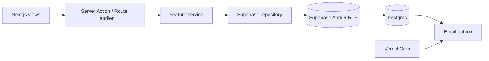

# Task Hub architecture

## Purpose

Task Hub is an internal workflow product for a Senior Director, Account Directors, and team members. It makes client delivery visible at personal, team, and organisation levels without giving client users access.

## Feature-aligned MVC

| Layer | Responsibility |
| --- | --- |
| `app/` | Route-level views, layouts, and the protected daily-digest Route Handler. |
| `features/*/views` | Presentational React components and interaction state. |
| `features/*/controllers` | Server Actions that authenticate, validate, authorise, and revalidate. |
| `features/*/models` | Types, Zod schemas, filters, and business vocabulary. |
| `features/*/services` | Use cases and reporting/delivery logic. |
| `features/*/repositories` | The only layer that performs Supabase data access. |
| `lib/supabase` | Cookie-based clients, proxy refresh, and server-only admin worker client. |

## Data and access model

- `teams` → `profiles` → `clients` → `tasks` are the core operational records.
- `task_activity` is trigger-written for creation, reassignment, status changes, and completion.
- `email_outbox` is trigger-written for allocations; the cron worker adds idempotent daily deadline digests.
- Senior Directors read and manage everything; Account Directors manage only their team; team members read team work but may only change the status of their own work.
- RLS backs every browser-accessible table. The email worker uses the Supabase service role only on the Vercel server to process non-user outbox rows; it must never be exposed to the client.

## Product rules

- Every task has exactly one accountable owner, one client (including `Internal operations`), a priority, a status, and a due date.
- Statuses are `todo`, `in_progress`, `blocked`, and `complete`; completing a task writes `completed_at`.
- Filters are a shared interface across List, Calendar, and Kanban. The assessment shell offers seeded interactive data; connected data uses the same domain model.
- Daily digests run at 09:00 Europe/London. Vercel invokes the endpoint at 08:00 and 09:00 UTC, and the handler checks UK local time to stay correct through daylight saving.
